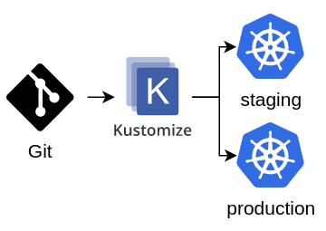

<h1 align="center">Kustomize</h1>

  
  

  

## 🌱 Project

- Laboratório para teste do Kustomize

## ✨ Ferramentas utilizadas

- Kubernetes
- Istio
- Docker
- Haproxy
- Docker-compose
- Kustomize
- Nginx

## 🚀 Etapas

- [x] [Gerar chave ssh](./k8s/keys/README.md)
- [X] [Subir um balanceador com Docker](./loadbalancer/Readme.md)
  - [x] [Configurar DNS local no /etc/hosts](./scripts/local_dns.sh)
  - [x] [Registro de DNS e configuração de backends](./loadbalancer/haproxy/haproxy.cfg)
- [x] [Subir infra local com vagrant e virtualbox](./Vagrantfile)
- [x] [Subir um Cluster Kubernetes](./kubespray/kubespray.md)
- [x] [Instalação do ISTIO](./istio/)
- [x] [Organizar estrutura de arquivos - Kustomize](./app/Readme.md)
  - [x] [Configurar DNS local para a aplicação no /etc/hosts](./scripts/local_dns.sh)
  - [x] [Criar arquivos base](./app/Readme.md)
  - [x] [ Criar camadas de sobreposição - OVERLAYS](./app/Readme.md)
    - [X] [Ambiente de desenvolvimento]
    - [x] [Ambiente de homologação]
    - [x] [Ambiente de produção]
- [x] [Apply deployments](./app/Readme.md)

## 📄 Licença
Esse projeto está sob a licença MIT. Veja o arquivo [LICENSE](LICENSE) para mais detalhes.

## 🙇 Referências
- [How to Configure Kubernetes Resources with Kustomize](https://www.vultr.com/docs/how-to-configure-kubernetes-resources-with-kustomize/?utm_source=performance-max-latam&utm_medium=paidmedia&obility_id=17096555207&utm_adgroup=&utm_campaign=&utm_term=&utm_content=&gclid=CjwKCAiA85efBhBbEiwAD7oLQMyRZGuK0ZFTnXpZ9yFpO2rUBePK1kgbD1u8Zqaz-hDeN2HSl1tL-xoCZmAQAvD_BwE)
- [Kustomize](https://kustomize.io/)