<h1 align="center">Kustomize e Argocd</h1>

<p align="center">
  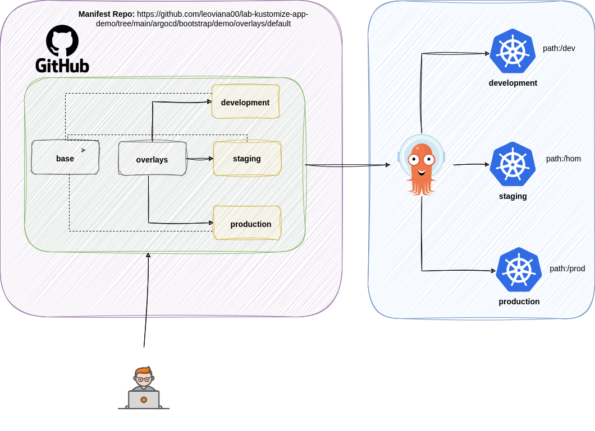
</p>

## 🌱 Project

- Laboratório para deploy de aplicações utilizando kustomize e argocd

## Estrutura dos arquivos
<p align="center">
  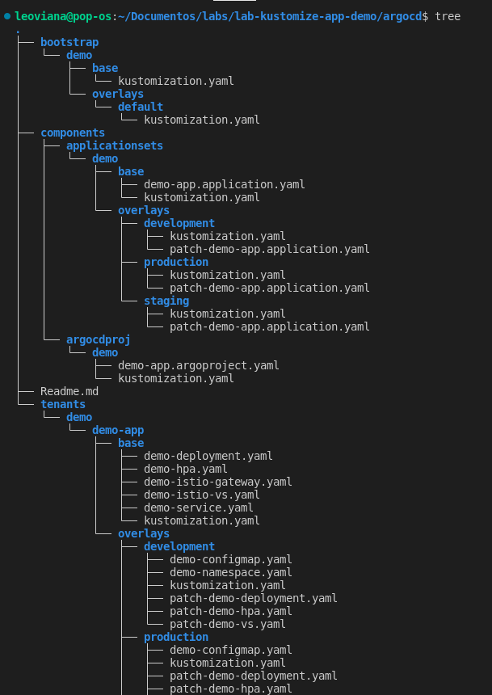
</p>

<p align="center">
  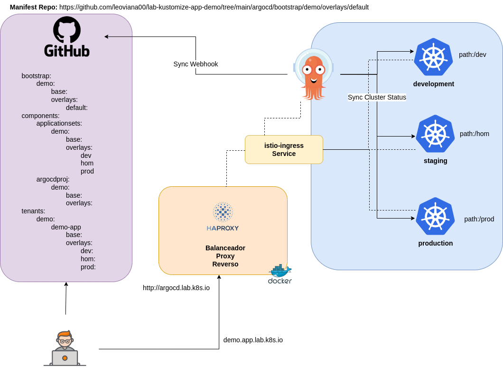
</p>


## Subindo as aplicações

```bash
kubectl apply -k bootstrap/demo/overlays/default/
```

<p align="center">
  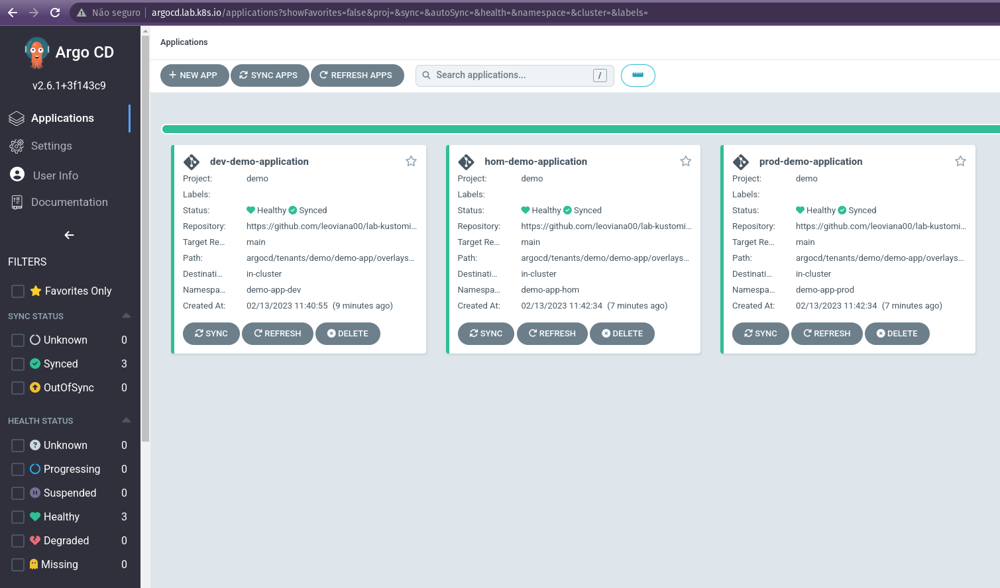
</p>

- Developement Application
<p align="center">
  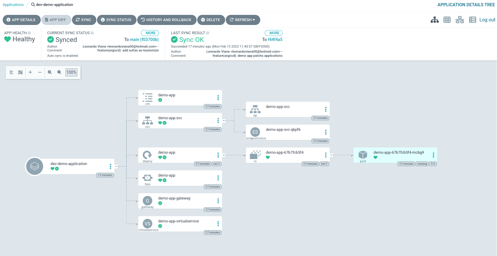
</p>

- Staging Application
<p align="center">
  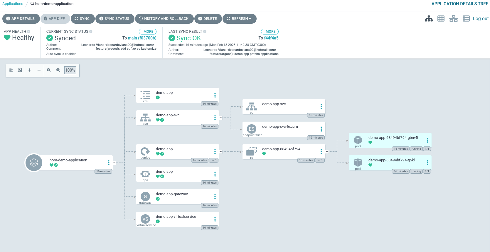
</p>

- Production Application
<p align="center">
  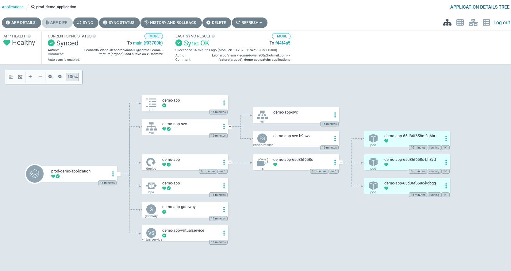
</p>

## Acessando as aplicações

- Aplicações Nginx - Squad A
- Produção: http://squad.a.nginx.lab.k8s.io/prod

<p align="center">
  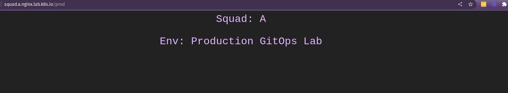
</p>

- Homologação: http://squad.a.nginx.lab.k8s.io/hom

<p align="center">
  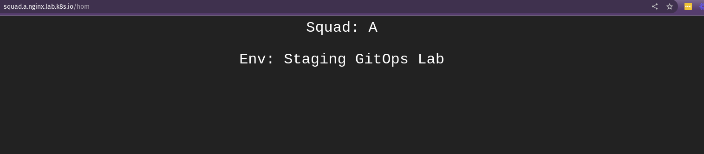
</p>

- Desenvolvimento: http://squad.a.nginx.lab.k8s.io/dev

<p align="center">
  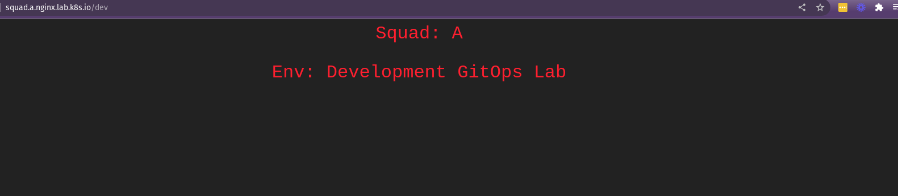
</p>


- Aplicações Go - Squad A
- Produção: http://ws.squad.a.go.lab.k8s.io/

<p align="center">
  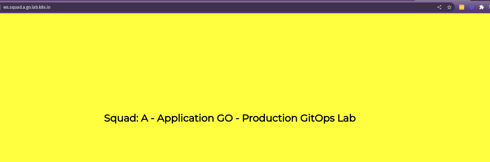
</p>

- Homologação: http://ws.hom.squad.a.go.lab.k8s.io/

<p align="center">
  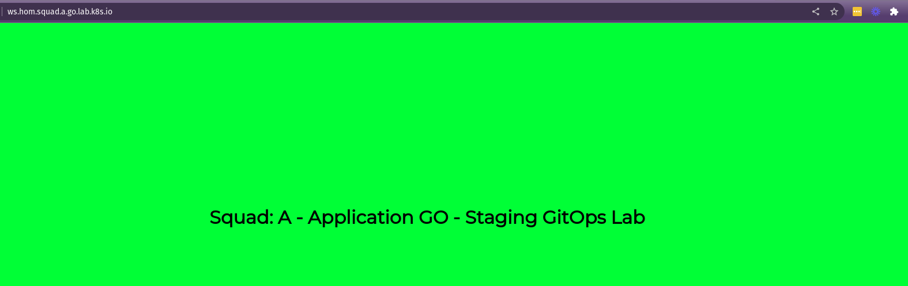
</p>

