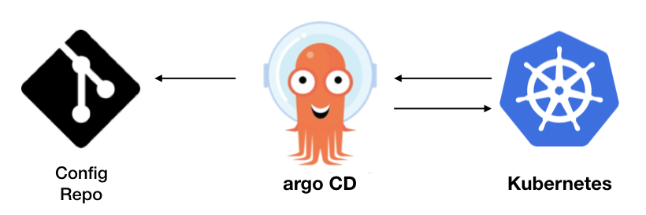

<h1 align="center">Kustomize e Argocd</h1>

<p align="center">
  
</p>

## 🌱 Project

- Laboratório para deploy de aplicações utilizando kustomize e argocd

## Estrutura dos arquivos
<p align="center">
  
</p>


## Subindo as aplicações

```bash
kubectl apply -k bootstrap/demo/overlays/default/
```

<p align="center">
  
</p>

- Developement Application
<p align="center">
  
</p>

- Staging Application
<p align="center">
  
</p>

- Production Application
<p align="center">
  
</p>