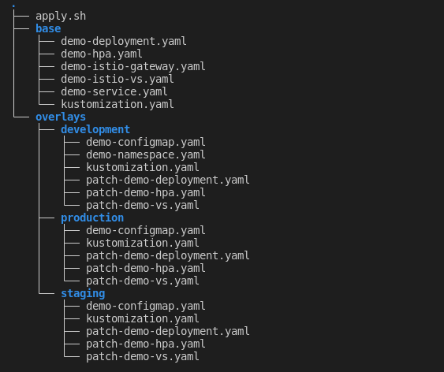
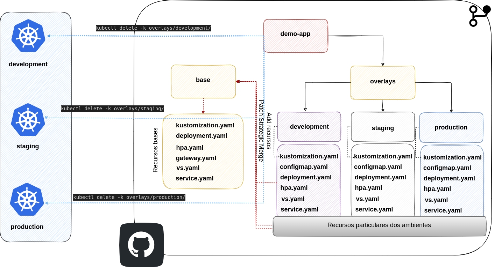
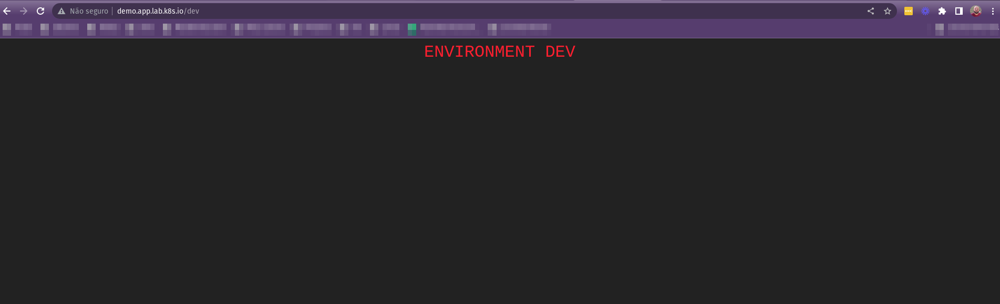
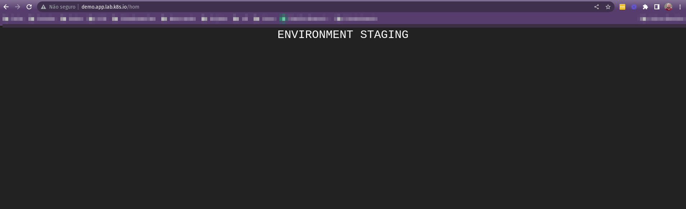
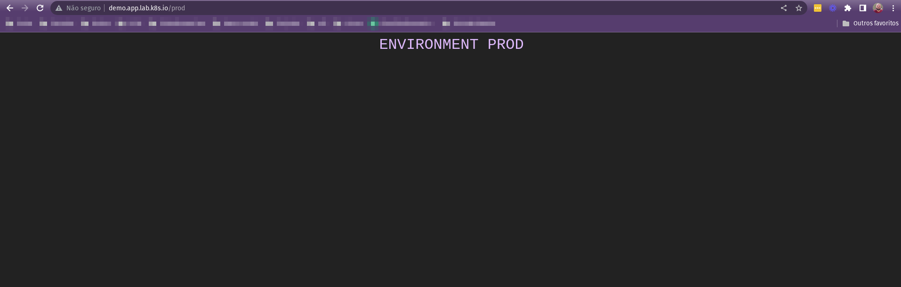

## Kustomize

- Estrutura dos arquivos

<p align="center">
  
</p>

- Diagrama estrutural

<p align="center">
  
</p>

## Apply

- Criando namespaces

```bash
kubectl create namespace demo-app-dev
kubectl label namespace demo-app-dev istio-injection=enabled

kubectl create namespace demo-app-hom
kubectl label namespace demo-app-hom istio-injection=enabled

kubectl create namespace demo-app-prod
kubectl label namespace demo-app-prod istio-injection=enabled
```

- Aplicando os deployments com `kubectl`

```bash
kubectl apply -k overlays/development/
kubectl apply -k overlays/staging/
kubectl apply -k overlays/production/
```

- Deletando os deployments de um ambiente

```bash
kubectl delete -k overlays/development/
```

- Deployment em multiplos ambientes

- Development: http://demo.app.lab.k8s.io/dev

<p align="center">
  
</p>

- Staging: http://demo.app.lab.k8s.io/hom

<p align="center">
  
</p>

- Production: http://demo.app.lab.k8s.io/prod

<p align="center">
  
</p>
