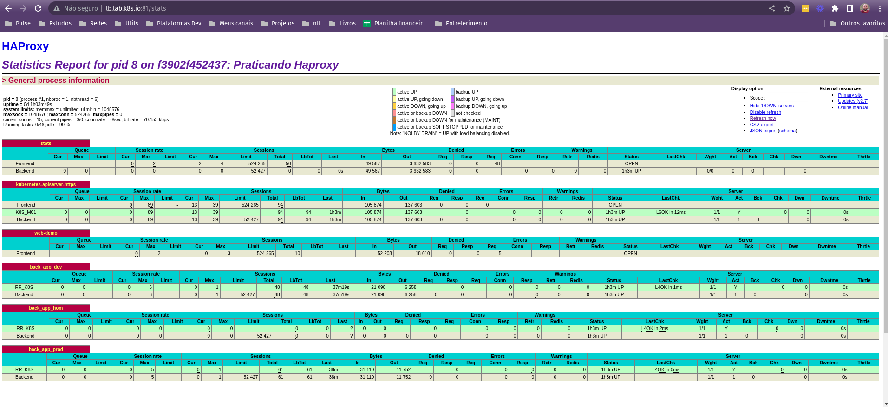

<h1 align="center">Balanceador Haproxy</h1>

<p align="center">
  <a href="#compose">Compose</a>&nbsp;&nbsp;&nbsp;|&nbsp;&nbsp;&nbsp;
  <a href="#comandos">Comandos</a>
</p>

<p align="center">
  
</p>


## Compose

- Criação de um docker-compose para subir um balanceador haproxy

  ```yaml
  version: "3.6"
  services:
      haproxy:
          image: haproxy
          env_file:
              - ./haproxy/haproxy.env
          volumes:
              - ./haproxy/haproxy.cfg:/usr/local/etc/haproxy/haproxy.cfg:ro
              - ./haproxy/abuse.lst:/usr/local/etc/haproxy/abuse.lst:ro
          ports:
              - "80:80"
              - "81:81"
              - "441:441"
              - "6443:6443"
              - "443:443"
              - "8081:8081"
  ```

- Aruivo de variáveis utilizadas

  - haproxy.env
  ```yaml
  #Global
  LOGGER=192.168.1.11

  #Listen Stats
  LISTEN=*
  STATS=enable
  STATSLP=admin:haproxy
  STATSURI=/stats
  STATSSHOW=Praticando Haproxy
  ABUSERS=/etc/haproxy/abuse.lst

  #Defaults
  TIMEOUT=50s
  
  #Listen Kubernetes-apiserver-https
  SERVER=192.168.50
  PORT_K8S=6443

  # Portds Ingress Istio
  HTTP_INGRESS_ISTIO=32651
  HTTPS_INGRESS_ISTIO=30838
  ```

- Criar arquivo de configuração haproxy
- Ativar dashboardo haproxy
- Adicionar o Cluster Kubernetes no haproxy
- Adicionar o argocd
- Adicionar serviço nginx de demonstração [ Ambiente dev, hom e prod]

  - haproxy.cfg

  ```yaml
  global
    log "${LOGGER}:514" local0
    log /dev/log  local0
    log /dev/log  local1 notice
    user haproxy
    group haproxy
    daemon

  defaults
      log global
      mode http
      timeout client "${TIMEOUT}"
      timeout server "${TIMEOUT}"
      timeout connect 5s

  listen stats
      bind "${LISTEN}:81"
      stats "${STATS}"
      # http-request rejeitar if { src -f "${ABUSERS}" }
      stats hide-version
      stats refresh 30s
      stats show-node
      stats auth "${STATSLP}"
      stats uri "${STATSURI}"
      stats show-desc "${STATSSHOW}"

  listen kubernetes-apiserver-https
      bind "${LISTEN}:6443"
      mode tcp
      option log-health-checks
      timeout client 3h
      timeout server 3h
      balance roundrobin
      server K8S_M01 "${SERVER}.11:${PORT_K8S}" check check-ssl verify none inter 2000

  frontend web-demo
      mode http
      bind "${LISTEN}:80"
      capture request header Host len 200
      option forwardfor

      acl dns_app hdr(host) -i demo.app.lab.k8s.io
      acl dns_argocd hdr(host) -i argocd.lab.k8s.io
      
      # Config Demo ACL Argocd
      acl path_argocd path_beg -i /
      use_backend back_argocd if dns_argocd path_argocd

      # Config Demo ACL App Ambiente DEV
      acl path_app path_beg -i /dev
      use_backend back_app_dev if dns_app path_app

      # Config Demo ACL App Ambiente HOM
      acl path_app path_beg -i /hom
      use_backend back_app_hom if dns_app path_app

      # Config Demo ACL App Ambiente PROD
      acl path_app_prod path_beg -i /prod
      use_backend back_app_prod if dns_app path_app_prod


  backend back_argocd
      mode http
      balance leastconn
      http-request set-header Host argocd.lab.k8s.io
      server RR_K8S "${SERVER}.41:${HTTP_INGRESS_ISTIO}" check 

  backend back_app_dev
      mode http
      balance leastconn
      http-request set-header Host demo.app.lab.k8s.io
      server RR_K8S "${SERVER}.41:${HTTP_INGRESS_ISTIO}" check 

  backend back_app_hom
      mode http
      balance leastconn
      http-request set-header Host demo.app.lab.k8s.io
      server RR_K8S "${SERVER}.41:${HTTP_INGRESS_ISTIO}" check 

  backend back_app_prod
      mode http
      balance leastconn
      http-request set-header Host demo.app.lab.k8s.io
      server RR_K8S "${SERVER}.41:${HTTP_INGRESS_ISTIO}" check 


  ```

## Comandos

- Subindo o balanceador

```bash
docker-compose up -d --build
```

- Derrubando o balanceador

```bash
docker-compose down
```

- Restartando o balanceador

```bash
docker-compose restart
```

- Haproxy Dashboard

<p align="center">
  
</p>